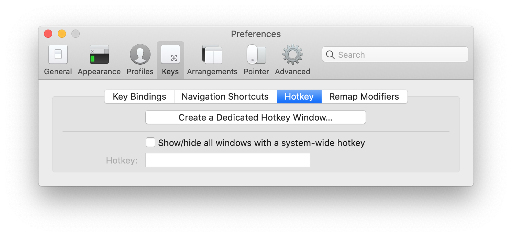

# iTerm2 Configuration

## Install iTerm2
* download from official site: [link](https://iterm2.com/)
* via [Homebrew](https://brew.sh/): `brew cask install iterm2`

## Hotkey Window
* Start iTerm2
* go to "iTerm2 - Preferences" (cmd+,)
* go to "Keys" tab
* go to "Hotkey" subtab
* click on "Create a Dedicated Hotkey Window..."

* select a hotkey, example: ctrl+alt+cmd+i

* click "OK"

## zsh
macOS comes with zsh preinstalled, if we want to use a newer version of zsh we can install it via Homebrew:
```
brew install zsh
# set zsh as default shell
chsh -s /usr/local/bin/zsh
```

### oh-my-zsh
[oh-my-zsh](https://github.com/ohmyzsh/ohmyzsh) is a framework for zsh configuration, it can be installed via an install script:
```
# first download the script, so it can be first inspected before running it
curl -Lo install.sh https://raw.githubusercontent.com/ohmyzsh/ohmyzsh/master/tools/install.sh
# run the script
sh install.sh
```

### Powerlevel10k
[Powerlevel10k](https://github.com/romkatv/powerlevel10k) is an zsh theme.

#### Install Fonts
* Download fonts:
    * [MesloLGS NF Regular.ttf](https://github.com/romkatv/powerlevel10k-media/raw/master/MesloLGS%20NF%20Regular.ttf)
    * [MesloLGS NF Bold.ttf](https://github.com/romkatv/powerlevel10k-media/raw/master/MesloLGS%20NF%20Bold.ttf)
    * [MesloLGS NF Italic.ttf](https://github.com/romkatv/powerlevel10k-media/raw/master/MesloLGS%20NF%20Italic.ttf)
    * [MesloLGS NF Bold Italic.ttf](https://github.com/romkatv/powerlevel10k-media/raw/master/MesloLGS%20NF%20Bold%20Italic.ttf)
* Double-click each font file and select "install"
* Configure iTerm2 to use the font:
    * go to "iTerm2 - Preferences" (cmd+,)
    * go to "Profiles" tab
    * select "Default" profile
    * select "Text"
    * set "Font" to "Meslo"
    * repeat the steps for the "Hotkey Window" profile
    
* Configure Apple Terminal to use the font:
    * go to "Terminal - Preferences" (cmd+,)
    * go to "Profiles" tab
    * select your profile
    * select "Text"
    * set "Font" to "Meslo"
    * repeat the steps for any profile you use
    

#### Install Powerlevel10k
```
git clone --depth=1 https://github.com/romkatv/powerlevel10k.git ${ZSH_CUSTOM:-~/.oh-my-zsh/custom}/themes/powerlevel10k
```
* Set `ZSH_THEME="powerlevel10k/powerlevel10k"` in `~/.zshrc`.
* Open new iTerm2 window, Powerlevel10k setup should automatically start, if not start it with `p10k configure`.
* Follow the setup wizard